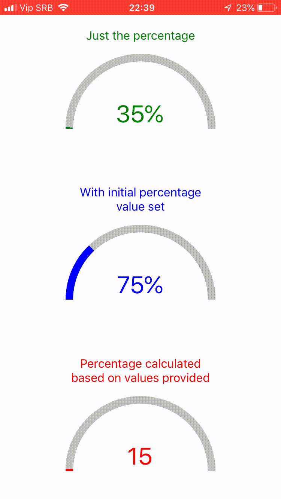

# react-native-semi-circle-progress



Semi Circle Progress component for React Native which uses only the native Views and requires no external libraries like react-native-svg or similar.

## Features
* Fully customizable
* Animated
* Lightweight

## Usage
```javascript
<SemiCircleProgress
    percentage={35}
    progressColor={"green"}
>
    <Text style={{ fontSize: 32, color: "green" }}>35%</Text>
</SemiCircleProgress>
```

## Props
|         Prop        |                   Desciption                  |         Type        | Default value |
|:-------------------:|:---------------------------------------------:|:-------------------:|:-------------:|
| progressShadowColor | Color of the unfilled progress bar            | string              | "silver"      |
| progressColor       | Color of the filled progress bar              | string              | "steelblue"   |
| interiorCircleColor | Bg color where component children reside      | string              | "white"       |
| circleRadius        | Radius of the semi-circle                     | number              | 100           |
| progressWidth       | Width of the progress bar                     | number              | 10            |
| percentage          | Percentage to show in the circle              | number              | /             |
| exteriorCircleStyle | Style of the whole circle container           | ViewPropTypes.style | /             |
| interiorCircleStyle | Style of the inner circle container           | ViewPropTypes.style | /             |
| animationSpeed      | Speed of the spring animation                 | number              | 2             |
| initialPercentage   | Sets initial percentage from which to animate | number              | 0             |
| minValue            | Min value of the circle progress              | number              | /             |
| maxValue            | Max value of the circle progress              | number              | /             |
| currentValue        | Current value of the circle progress          | number              | /             |

## Note
Percentage has higher order, if provided component assumes that you calculated it already and ignores minValue, maxValue and currentValue props